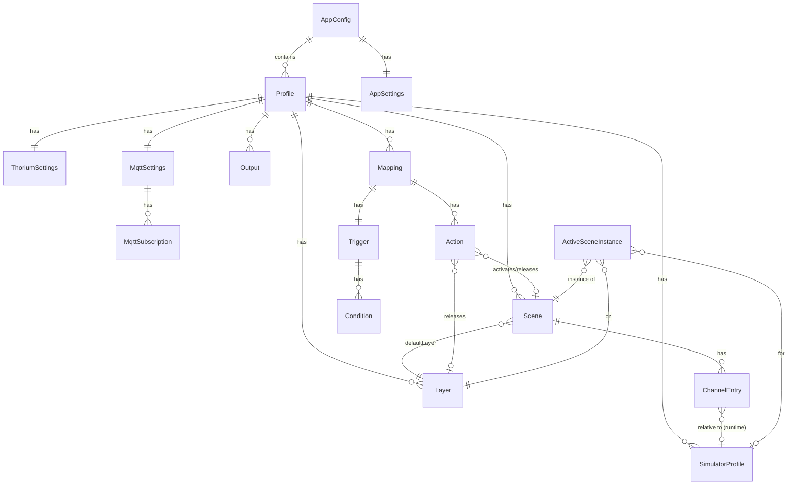

# CMSC Lighting Client — Entity Relationship & Implementation Design

Version 1.0 · 2026-09-01 · Companion to `PRD_claude.md`

This document is the engineering design. It defines the data model, the runtime architecture, every module and its responsibilities, the IPC contract, the wire protocols, and the implementation order. Requirement IDs from the PRD are cited as `[F-XXX-nn]`.

---

## 1. Technology decisions

| Concern | Choice | Reason |
|---------|--------|--------|
| Shell | Electron 39 + electron-vite 5 (existing scaffold), TypeScript 5.9, Node 22 | Already in repo; main/preload/renderer split matches the design. |
| Renderer | React 19, React Router 7, Zustand 5, Tailwind CSS 4 (`@tailwindcss/vite`), Radix UI primitives (dialog, select, tooltip, dropdown, switch, slider), `lucide-react` icons | Chosen in discovery. Tailwind 4 needs no PostCSS config. |
| Validation | Zod 4 | Single source of truth for config schema, IPC payloads and import validation. |
| sACN | `sacn` 4.x (`Sender`) | Typed, maintained, supports multicast/unicast, priority, interface binding and automatic keep-alive (`minRefreshRate`). Wrapped behind our `Output` interface; `e131` can be swapped in if needed. |
| Serial | `serialport` 13 (`SerialPort`, `SerialPort.list()`) | N-API prebuilds run under Electron without a rebuild. Enttec Pro framing is 30 lines and written in-house (mirrors Thorium's driver). |
| MQTT | `mqtt` 5 | De-facto client; supports mqtt/mqtts/ws/wss, last-will, reconnect. |
| Thorium transport | `ws` 8 + a small in-house `subscriptions-transport-ws` client; `fetch` for HTTP | Thorium runs Apollo Server 2 with the legacy protocol. Writing ~150 lines avoids an unmaintained dependency and gives us full control of reconnects. |
| Logging | `electron-log` 5 | Rolling files, main and renderer transports. |
| Tests | Vitest 4 | Pure modules (matcher, compositor, protocol framing, migrations) are unit tested. |

No changes to Thorium are made. No GraphQL codegen: operations are hand-written strings, typed with local TS interfaces.

## 2. Process architecture

```
Electron main process (Node)                      Renderer (Chromium)
──────────────────────────────                    ───────────────────
ConfigStore ──► seeds/migrations                  Zustand store (mirror)
   │                                                     ▲
   ├─► SourceManager                                     │ IPC push (state:*, events:batch,
   │     ├─ ThoriumAdapter ─┐                            │           outputs:health, dmx:frame)
   │     ├─ MqttAdapter ────┤──► EventBus ──► EventLog   │
   │     └─ UiAdapter ──────┘        │                   │
   │                                 ▼                   │
   ├─► RulesEngine (Matcher + ActionRunner)              │
   │                                 │                   │
   ├─► Compositor (Layers, ActiveScenes, Fades, GM, BO)  │
   │                                 │                   │
   ├─► OutputManager ──► SacnOutput / EnttecOutput       │
   │                                                     │
   └─► IpcRouter ◄───────── invoke (commands) ───────────┘
              └──────────── preload contextBridge `window.api`
```

Everything that must keep running when the window is closed lives in main. The renderer never touches Node APIs (`sandbox: true`, `contextIsolation: true`, `nodeIntegration: false`).

## 3. Source layout

```
src/
  shared/                       # imported by main AND renderer; no node/electron imports
    types/
      config.ts                 # Profile, Output, Scene, Mapping, Trigger, Action, Layer, SimulatorProfile…
      events.ts                 # AppEvent, EventSource
      ipc.ts                    # IpcApi (invoke) + IpcPush (main→renderer) contracts
      state.ts                  # RuntimeState snapshot types (health, active scenes…)
    schema/
      config.schema.ts          # zod schemas + inferred types
      migrations.ts             # schemaVersion upgrades
    triggers/
      catalog.ts                # trigger presets: metadata + compile(params) → CompiledTrigger
      conditions.ts             # Condition ops + path resolution (pure)
      matcher.ts                # matchEvent(compiled, event) (pure)
    templates.ts                # {{ path }} interpolation for MQTT payloads (pure)
    seed.ts                     # first-run defaults (layers, simulators, example scenes/mappings)
    constants.ts
  main/
    index.ts                    # bootstrap: single instance, config, services, window, tray
    app/
      window.ts                 # BrowserWindow factory, state persistence
      tray.ts                   # tray icon + menu
      lifecycle.ts              # launch-at-login, quit handling, final zero frame
    config/
      store.ts                  # ConfigStore: load/save/atomic write/backups/import/export
      secrets.ts                # safeStorage-backed secret vault
    core/
      eventBus.ts               # typed emitter for AppEvent
      eventLog.ts               # ring buffer + batch forwarding to renderer
      rules/
        engine.ts               # subscribes to EventBus, evaluates mappings, runs actions
        actions.ts              # ActionRunner: activateScene, releaseScene, blackout, setLevel, holdLevel, publishMqtt, thoriumMutation
      compositor/
        compositor.ts           # active scene instances, per-universe frame generation
        envelope.ts             # fade in/hold/fade out envelope math (pure)
        scheduler.ts            # 40 Hz tick with drift correction
      simulators.ts             # SimulatorRegistry: name↔id, scope resolution, relative addressing
      runtimeState.ts           # aggregates health + active scenes → snapshot for renderer
    sources/
      thorium/
        protocol.ts             # SubscriptionsTransportWsClient (ws framing, reconnect, subscriptions)
        http.ts                 # query/mutate over fetch with clientid header
        operations.ts           # GraphQL strings: subscriptions, queries, mutations
        derived.ts              # state diffing → derived events (alert level, battery thresholds…)
        adapter.ts              # ThoriumAdapter: lifecycle, client registration, scope, reference data cache
      mqtt/
        adapter.ts              # MqttAdapter: connect, subscriptions, message → event
        publisher.ts            # status topics, publish action, last-will
        commands.ts             # <base>/cmd handler
      ui/
        adapter.ts              # UiAdapter: turns IPC commands into AppEvents
    outputs/
      types.ts                  # Output interface + health model
      manager.ts                # OutputManager: create/destroy outputs, route frames, health
      sacnOutput.ts             # sACN sender wrapper
      enttecOutput.ts           # Enttec USB DMX Pro serial driver
      serialDevices.ts          # SerialPort.list() with friendly names
    ipc/
      router.ts                 # ipcMain.handle bindings, validated with zod
      push.ts                   # throttled main→renderer broadcasts
    logging.ts
  preload/
    index.ts                    # contextBridge.exposeInMainWorld('api', …)
    index.d.ts
  renderer/src/
    main.tsx, App.tsx, router.tsx
    store/
      runtime.ts                # zustand: runtime snapshot mirrored from main
      config.ts                 # zustand: active profile + draft editing + save
      events.ts                 # zustand: inspector ring buffer
    lib/api.ts                  # typed wrapper over window.api
    components/ui/              # Button, IconButton, Pill, Card, Field, Input, NumberInput, Select, Switch,
                                # Slider, Table, Tabs, Toast, InlineConfirm, EmptyState, Kbd, Badge, Drawer
    components/layout/          # AppShell, Sidebar, StatusBar, PageHeader
    features/
      dashboard/                # DashboardPage, SceneButtonGrid, GlobalControls, ActivityTicker
      scenes/                   # ScenesPage, SceneEditor, ChannelGrid, ChannelTable, BulkEntry
      mappings/                 # MappingsPage, MappingEditor, TriggerPicker, ConditionBuilder, ActionList, SimulatePanel
      thorium/                  # ThoriumPage, ConnectionForm, ScopeForm, ConnectionTest, EventInspector
      mqtt/                     # MqttPage, BrokerForm, SubscriptionsTable, StatusTopics, PublishTester, MessageView
      outputs/                  # OutputsPage, OutputCard, SacnForm, EnttecForm, UniverseMonitor, ChannelTester
      simulators/               # SimulatorsPage, ProfileTable, AddressMap
      layers/                   # LayersPage
      settings/                 # SettingsPage, ProfilesPanel, StartupPanel, ImportExport, Diagnostics, PinLock
      wizard/                   # FirstRunWizard
    styles/app.css              # Tailwind import + design tokens
```

## 4. Data model

### 4.1 Entity relationship diagram



`ActiveSceneInstance` is runtime-only (not persisted). Everything else is persisted in `config.json`.

### 4.2 Persisted entities

All ids are UUID v4 strings. All names are user-facing and unique within their profile (enforced on save).

```ts
// shared/types/config.ts (abridged; zod schemas in shared/schema/config.schema.ts are canonical)

export interface AppConfig {
  schemaVersion: 4;                  // v1→v2 trigger.simulatorName → simulatorNames[] + mapping.category;
                                     // v2→v3 conditions may contain "any of" groups; v3→v4 mapping.trigger →
                                     // mapping.triggers[] (ORed) and simulatorNames hoisted to the mapping
  settings: AppSettings;
  profiles: Profile[];
  activeProfileId: string;
}

export interface AppSettings {
  instanceName: string;              // used in MQTT base topic and Thorium client label
  launchAtLogin: boolean;
  startMinimized: boolean;
  closeToTray: boolean;
  sendZeroFrameOnExit: boolean;
  theme: 'dark' | 'light' | 'system';
  setupPin: string | null;           // 4–8 digits, hashed (sha256 + salt); null = unlocked
  eventLogSize: number;              // ring buffer, default 2000
  logLevel: 'debug' | 'info' | 'warn' | 'error';
  window: { width: number; height: number; x?: number; y?: number } | null;
  wizardCompleted: boolean;
}

export interface Profile {
  id: string;
  name: string;
  kind: 'central' | 'single-ship';
  thorium: ThoriumSettings;
  mqtt: MqttSettings;
  outputs: Output[];
  simulators: SimulatorProfile[];
  layers: Layer[];
  scenes: Scene[];
  mappings: Mapping[];
  mappingGroups: MappingGroup[];     // schema v8: switchable sets of mappings (§5.1b)
  grandMaster: number;               // 0–1, persisted so it survives restarts
}

export interface MappingGroup {
  id: string;
  name: string;
  color: string;                     // hex, for the status-bar switcher and badges
}

export interface ThoriumSettings {
  enabled: boolean;
  host: string;                      // "localhost"
  port: number;                      // 4444
  secure: boolean;                   // https/wss
  clientId: string;                  // generated once: "lighting-<hostname>-<4 chars>"
  clientLabel: string;               // "Lighting Client – <hostname>"
  scope:
    | { mode: 'assigned-flight' }      // all simulators of the FD-assigned flight (per room)
    | { mode: 'follow-assignment' }    // only the FD-assigned simulator
    | { mode: 'pinned'; simulatorNames: string[] }
    | { mode: 'all' };
  unassignedBehavior: 'release' | 'hold'; // when the FD un-assigns/moves this client
  batteryThresholds: number[];       // e.g. [0.5, 0.25, 0.1] used by derived events
  reactorHeatThreshold: number;      // 0.9
}

export interface MqttSettings {
  enabled: boolean;
  url: string;                       // "mqtt://broker.local:1883"
  clientId: string;
  username: string | null;
  passwordSecretId: string | null;   // key into the secret vault
  keepalive: number;                 // 60
  cleanSession: boolean;
  rejectUnauthorized: boolean;       // TLS
  subscriptions: MqttSubscription[];
  publish: {
    enabled: boolean;
    baseTopic: string;               // "cmsc/lighting/{instanceName}"
    publishEvents: boolean;          // firehose to <base>/events (off)
    commandTopic: boolean;           // listen on <base>/cmd
    qos: 0 | 1 | 2;
  };
}

export interface MqttSubscription { id: string; topic: string; qos: 0 | 1 | 2; enabled: boolean; }

export type Output =
  | { id: string; name: string; enabled: boolean; driver: 'sacn'; universe: number;
      sacn: { mode: 'multicast' | 'unicast'; unicastAddress: string | null; priority: number;
              sourceName: string; iface: string | null; fps: number; keepAliveMs: number } }
  | { id: string; name: string; enabled: boolean; driver: 'enttec-pro'; universe: number;
      enttec: { portPath: string; serialNumber: string | null; fps: number } };

export interface SimulatorProfile {
  id: string;
  name: string;                      // must equal the Thorium simulator name (case-insensitive match)
  universe: number;                  // output universe for relative scenes
  baseAddress: number;               // 1–512; relative channel 0 == baseAddress
  color: string;                     // hex, UI only
  confirmed: boolean;                // false for seeded placeholders → UI warning badge
}

export interface Layer { id: string; name: string; priority: number; locked: boolean; } // locked: Test, Blackout

export interface ChannelEntry {
  channel: number;                   // absolute: 1–512; relative: 0–511 offset from baseAddress
  value: number;                     // 0–255
  universe?: number;                 // absolute mode only; defaults to scene.defaultUniverse
}

export interface Scene {
  id: string;
  name: string;
  category: string;                  // free text; used to group dashboard buttons
  color: string;
  addressing: 'absolute' | 'relative';
  defaultUniverse: number;           // absolute mode
  entries: ChannelEntry[];
  behavior: { kind: 'latch' } | { kind: 'timed'; holdMs: number };
  fadeInMs: number;
  fadeOutMs: number;
  defaultLayerId: string;
  showOnDashboard: boolean;
  reducedEffectsCleared: boolean;   // human-checked as safe for light-sensitive guests (schema v5, PRD §6.9)
  notes: string;
}

export type ConditionOp = 'eq' | 'neq' | 'contains' | 'gt' | 'gte' | 'lt' | 'lte' | 'regex' | 'exists' | 'notExists';
export interface Condition { path: string; op: ConditionOp; value?: string | number | boolean; }

export type ConditionNode = Condition | { any: Condition[] };   // schema v3: one level of "any of" groups

export interface Trigger {
  preset: string;                    // key into shared/triggers/catalog.ts, e.g. "thorium.alertLevel", "custom.event"
  params: Record<string, unknown>;   // preset-specific, validated by the preset's zod schema
  conditions: ConditionNode[];       // extra conditions, ANDed; a group passes if any of its leaves does
}

export type Action =
  | { kind: 'activateScene'; sceneId: string; target: 'event' | 'all' | { simulatorName: string };
      layerId: string | null; holdMsOverride: number | null }
  | { kind: 'releaseScene'; sceneId: string; target: 'event' | 'all' | { simulatorName: string } }
  | { kind: 'releaseLayer'; layerId: string; target: 'event' | 'all' }
  | { kind: 'blackout'; on: boolean }
  | { kind: 'setLevel'; target: 'event' | 'all' | { simulatorName: string };
      addressing: 'absolute' | 'relative'; universe?: number; channels: number[];
      source: { path: string; inMin: number; inMax: number; outMin: number; outMax: number;
                curve: 'linear' | 'square' | 'sqrt'; invert: boolean };
      fade: { kind: 'none' } | { kind: 'fixed'; ms: number }
          | { kind: 'fromEvent'; path: string; fallbackMs: number };
      layerId: string | null; label: string;
      idle: { value: number; ignoreInitialZero: boolean } | null }   // schema v8: "no signal" floor (§6.3b)
  | { kind: 'holdLevel'; target: 'event' | 'all' | { simulatorName: string };
      addressing: 'absolute' | 'relative'; universe?: number; channels: number[];
      value: number;                                  // 0–255, set here — the event only supplies the time
      hold: { kind: 'fromEvent'; path: string; units: 'ms' | 'seconds'; fallbackMs: number }
          | { kind: 'fixed'; ms: number } | { kind: 'latch' };
      fallback: { value: number; hold: /* as above */ } | null;   // second stage; null releases at the end of the hold
      fade: /* as setLevel */ { kind: 'none' } | { kind: 'fixed'; ms: number }
          | { kind: 'fromEvent'; path: string; fallbackMs: number };
      layerId: string | null; label: string }
  | { kind: 'publishMqtt'; topic: string; payload: string; qos: 0 | 1 | 2; retain: boolean }
  | { kind: 'thoriumMutation';
      mutation: { kind: 'triggerMacro'; macroName: string }
              | { kind: 'setAlertLevel'; level: '1' | '2' | '3' | '4' | '5' | 'p' }
              | { kind: 'notify'; title: string; body: string; color: string } }
  | { kind: 'setMappingGroup'; groupId: string };     // schema v8: make another mapping group active

export interface Mapping {
  id: string;
  name: string;
  enabled: boolean;
  category: string;                  // schema v2: free-text grouping for filters ("Alert levels", "Effects", …)
  triggers: Trigger[];               // schema v4: the mapping fires when ANY of these matches (min 1)
  simulatorNames: string[];          // schema v4 (was per-trigger): only events from these simulators; empty = any in scope
  actions: Action[];
  debounceMs: number;                // 0 = none
  groupIds: string[];                // schema v8: fires only while one of these groups is active; empty = every group
  notes: string;
}
```

`target: 'event'` means "the simulator the event came from" (falls back to `'all'` for events with no simulator, e.g. MQTT). For a `single-ship` profile there is exactly one simulator in scope so all targets collapse to it.

### 4.3 Runtime entities (main process only)

```ts
export interface AppEvent {
  id: string;
  ts: number;
  source: 'thorium' | 'mqtt' | 'ui' | 'system';
  type: string;          // see §5.1
  name: string;          // thorium event name | mqtt topic | ui action | derived event name
  simulatorId?: string;
  simulatorName?: string;
  data: Record<string, unknown>;   // condition paths resolve against this
  matchedMappingIds: string[];     // filled by RulesEngine before forwarding to the log
  staffOrigin?: boolean;           // set only by direct staff commands (Dashboard, tray, alert override)
  trace?: EventTrace[];            // per matched mapping: actions run, debounce, heldBack[{action, reason}]
}

export interface ActiveSceneInstance {
  instanceId: string;
  sceneId: string;
  layerId: string;
  simulatorId: string | null;      // null for absolute scenes with target 'all' or no simulator
  simulatorName: string | null;
  startedAt: number;
  fadeInMs: number;
  fadeOutMs: number;
  holdUntil: number | null;        // timed scenes
  releaseStartedAt: number | null; // set when release begins; removed when fade-out completes
  frames: Map<number /*universe*/, Uint8Array /*513, index 1..512, 0 = untouched marker via mask*/>;
  masks: Map<number, Uint8Array>;  // 1 where the scene sets the channel
  origin: { mappingId?: string; eventId?: string; ui?: boolean };
}

export interface RuntimeSnapshot {
  thorium: { state: ConnState; reason?: string; serverVersion?: string; flight?: {id; name}; 
             simulatorsInScope: {id; name; alertLevel; training}[]; assignment?: {...}; rttMs?: number;
             eventsPerSec: number; reconnects: number };
  mqtt: { state: ConnState; reason?: string; connectedSince?: number; subscriptions: {topic; count}[];
          messagesPerSec: number; reconnects: number };
  outputs: Record<string /*outputId*/, OutputHealth>;
  compositor: { blackout: boolean; grandMaster: number;
                active: Array<Pick<ActiveSceneInstance,'instanceId'|'sceneId'|'layerId'|'simulatorName'|'startedAt'|'holdUntil'|'releaseStartedAt'>> };
  mappingsStats: Record<string, { lastFiredAt: number | null; count: number }>;
  lightingMode: { mode: 'normal' | 'reduced' | 'locked'; since: number; staleDay: boolean;
                  heldBack: { count: number; last: { ts: number; text: string } | null } };
}
export type ConnState = 'disabled' | 'connecting' | 'connected' | 'reconnecting' | 'error';
export interface OutputHealth { state: 'disabled' | 'starting' | 'ok' | 'error'; reason?: string; fps: number; lastSendAt: number | null; iface?: string; }
```

## 5. Event model and trigger presets

### 5.1 Event types

| `type` | `name` | `data` | Produced by |
|--------|--------|--------|-------------|
| `thorium.event` | Thorium event name (e.g. `changeSimulatorAlertLevel`) | the raw firehose payload: `{ event, clientId, isMutation, core, ...args }` | `ThoriumAdapter` from `events` subscription |
| `thorium.state` | derived name (`alertLevel.changed`, `training.changed`, `lighting.actionChanged`, `battery.below`, `battery.above`, `reactor.ejected`, `reactor.externalPower`, `reactor.heatAbove`, `system.damaged`, `system.repaired`, `system.powerChanged`, `flight.started`, `flight.paused`, `flight.resumed`, `flight.reset`, `shields.raised`, `shields.lowered`, `stealth.changed`, `client.assigned`) | derived fields (`{ level, previous }`, `{ threshold, level }`, `{ systemName, type }` …) | `derived.ts` diffing state subscriptions |
| `mqtt.message` | topic | `{ topic, payload: string, json?: unknown, qos, retain }` | `MqttAdapter` |
| `ui.action` | `scene.activate`, `scene.release`, `blackout`, `releaseAll`, `grandMaster`, `alertOverride`, `lightingMode` | action-specific | `UiAdapter` |
| `system` | `startup`, `thorium.connected`, `thorium.disconnected`, `mqtt.connected`, `output.error`… | | services |

Simulator attribution: `thorium.event` payloads that carry `simulatorId` are tagged; events that carry only a system `id` (e.g. `reactorBatteryChargeLevel`) are resolved through the `SimulatorRegistry` system→simulator index built from `systemsUpdate`. Events outside the instance's simulator scope are dropped before they reach the bus (they are still counted for the "events/sec" metric).

### 5.1a Lighting modes

`shared/lightingMode.ts` holds the only rule table (`gateAction(mode, request, { staffOrigin })`, PRD §6.9). It returns `null` (allowed) or a human reason. Call sites:

- `RulesEngine.onEvent`, after debounce and before running: actions are split into allowed and held back; held-back ones go into `trace.heldBack`. A mapping with nothing allowed is not counted as fired (no `matchedMappingIds`, stats or debounce stamp). `evaluate()` reports the same split for Simulate.
- `Services.onMqttCommand`, before dispatch: a held-back command emits `system`/`lightingMode.heldBack` so it appears in the inspector.
- Renderer hints (Mappings badge, ActionsEditor, mode dialog) call it with `mode: 'reduced'`.

`setLevel` is allowed in Reduced Effects (and still blocked in Locked): it tracks a
value the FD already set and cannot flash, and holding it back would freeze the
channel wherever it stood when the mode changed — worse for a light-sensitive
guest than letting it keep following.

`holdLevel` is **not**: it picks its own value and drops it again when the hold
ends, so a short one is exactly the flash Reduced Effects exists to hold back.

Direct staff commands (`activateSceneByUser`, blackout, release all, Grand Master, alert override from the UI) never pass through the gate. Events they emit carry `staffOrigin`; Locked lets mappings fired by those through, Reduced still filters them.

Mode state lives in `Services` and is persisted by `main/config/modeState.ts` as `userData/lighting-mode.json` `{ mode, since, day }` (atomic write, outside config.json). `load()` restores it only when `day` is today; it runs in `init()` before any source starts. `setLightingMode(mode, { releaseUncleared, catchUpAlerts })` optionally releases active scenes that aren't cleared (entering Reduced) and re-asserts each in-scope simulator's alert level (moving to a less restrictive mode), then emits `ui.action`/`lightingMode`. `staleDay` is computed per snapshot; nothing switches automatically.

### 5.1b Mapping groups

A profile may define `mappingGroups`; exactly one is active at a time (the first,
until staff pick another). `RulesEngine.setActiveGroup(id)` recompiles with
`mappingInGroup()` (`shared/mappingGroups.ts`): a mapping takes part when it is
enabled and its `groupIds` is empty or contains the active id. With no groups
defined everything fires, as before. This is how one room carries two looks for
the same alert levels (purple desks vs pink desks) without swapping profiles.

The active group is operational state, like the lighting mode: persisted by
`main/config/groupState.ts` in `userData/mapping-group.json`
`{ byProfile: { [profileId]: { groupId, since } } }`, **no daily reset**.
`resolveActiveGroup()` falls back to the first group when the saved id is gone.

`Services.setMappingGroup(groupId, by)` — called from the status-bar switcher
(`mappingGroup.set` IPC), the tray submenu, or a `setMappingGroup` action — saves
the choice, releases compositor instances whose `origin.mappingId` is no longer
live (floors and the test layer exempt), re-applies floors, emits
`mappingGroup` (`ui.action` from staff, `system` from a mapping) and re-asserts
every in-scope simulator's alert level so the new look appears at once.

The action runs deferred (`queueMicrotask`) so the switch never happens half-way
through the engine walking mappings for one event. Because re-asserting the alert
level can fire another switch, mapping-initiated switches are capped at five per
two seconds (a loop is reported as an error toast); staff switches are never
limited. `setMappingGroup` is in `gateAction`'s non-lighting set: it changes no
channel itself, and everything it brings in is gated on its own. The active group
is published on MQTT as `<base>/mappingGroup`.

### 5.2 Trigger presets

Presets live in `shared/triggers/catalog.ts` so the renderer can render their forms and main can compile them identically. Each preset has: `key`, `label`, `group`, `description`, `paramsSchema` (zod), `form` descriptor (field list for auto-rendering), and `compile(params) → CompiledTrigger`.

```ts
export interface CompiledTrigger {
  types: string[];                 // any of
  names?: string[];                // any of (exact) — omitted means any name
  conditions: Condition[];         // AND
}
```

| Preset key | Group | Params | Compiles to |
|------------|-------|--------|-------------|
| `thorium.alertLevel` | Alert | `levels: ('1'…'5'|'p')[]`, `includeTraining: boolean` | `type=thorium.state name=alertLevel.changed cond level in levels` (training handled in derived: when training on, emits `alertLevel.changed level=5 training=true`) |
| `thorium.alertLevelAny` | Alert | – | `name=alertLevel.changed` |
| `thorium.training` | Alert | `on: boolean` | `name=training.changed cond training eq on` |
| `thorium.lightingAction` | Lighting | `actions: LIGHTING_ACTION[]` | `type=thorium.event name=lightingSetEffect,updateSimulatorLighting,lightingShakeLights,lightingFadeLights` + derived `lighting.actionChanged` cond action in actions |
| `thorium.lightingIntensity` | Lighting | `op: 'any'|'lt'|'gt'|'eq'`, `value`, `includeInitial` | `name=lighting.intensityChanged`; `op=any` compiles no condition (what a `setLevel` follow wants) |
| `thorium.generic` | Macros | `key: string` (glob allowed) | `type=thorium.event name=generic cond key glob` |
| `thorium.macro` | Macros | `macroName` | `name=triggerMacroAction cond macroId eq <resolved id>` (resolved at compile time through registry; re-compiled when reference data refreshes) |
| `thorium.macroButton` | Macros | `configName`, `buttonName` | `name=triggerMacroButton cond configId,buttonId` |
| `thorium.timelineItem` | Macros | `missionName`, `stepName`, `itemName?` | `name=triggerMacros cond macros[].stepId contains <ids>` (matcher supports `[]` wildcard) |
| `thorium.action` | Actions | `actions: string[]` (flash, spark, blackout, power…) | `name=triggerAction cond action in actions` |
| `thorium.sound` | Actions | `assetContains` | `name=playSound cond sound.asset contains` |
| `thorium.keyboardKey` | Actions | `key`, `meta[]` | `name=triggerKeyboardAction` |
| `thorium.battery` | Power | `direction: 'below'|'above'`, `threshold` (0–1) | `name=battery.<direction> cond threshold eq` |
| `thorium.reactor` | Power | `event: 'ejected'|'restored'|'externalPowerOn'|'externalPowerOff'|'heatAbove'` | derived names |
| `thorium.systemDamage` | Power | `state: 'damaged'|'repaired'`, `systemName?` | derived names + cond |
| `thorium.shields` | Ship | `state: 'raised'|'lowered'` | derived |
| `thorium.weapons` | Ship | `which: 'phasers'|'torpedo'` | `name=firePhasers` / `fireTorpedo` |
| `thorium.selfDestruct` | Ship | – | `name=setSelfDestructTime cond time gt 0` |
| `thorium.flight` | Flight | `event: started|paused|resumed|reset|ended` | derived |
| `thorium.clientAssigned` | Flight | – | derived `client.assigned` |
| `custom.event` | Custom | `eventName` (autocomplete), conditions | `type=thorium.event name=eventName` |
| `custom.any` | Custom | – | `type=thorium.event` (use with conditions) |
| `mqtt.message` | MQTT | `topicFilter` (wildcards), conditions on `payload`/`json.*` | `type=mqtt.message` + topic glob cond |
| `ui.action` | UI | `action`, `sceneName?` | `type=ui.action` |
| `system.startup` | System | – | `type=system name=startup` |

Condition path grammar: dot path with optional `[n]` or `[]` (any element). Resolved against `event.data`. Values are compared loosely for `eq` (`"1" == 1`) because Thorium mixes strings and numbers. `contains` works on strings and arrays. `regex` uses `new RegExp(value)` cached per mapping.

### 5.3 Matching algorithm (`matcher.ts`)

```
matchTrigger(compiled, event):
  if compiled.unresolved → false
  if event.type ∉ compiled.types → false
  if compiled.names && event.name ∉ compiled.names → false
  for n in compiled.conditions:            # leaves are ANDed; a group passes if any leaf does
    if !evalNode(n, event.data) → false
  return true
matchMapping(m, event):
  if m.simulatorNames && !anyEqualsIgnoreCase(m.simulatorNames, event.simulatorName) → false
  return any(matchTrigger(t, event) for t in m.triggers)
RulesEngine.onEvent(event):
  for m in enabledMappings (pre-compiled, cached, invalidated on config change):
    if !matchMapping(m.compiled, event) → skip
    if m.debounceMs && now - lastFired[m.id] < m.debounceMs → skip
    lastFired[m.id] = now; stats[m.id].count++
    event.matchedMappingIds.push(m.id)
    ActionRunner.run(m, event)
  EventLog.append(event)
```

Mapping count is small (tens to low hundreds) and event rate is modest (peaks of a few hundred per second during timeline steps), so linear evaluation is fine.

## 6. Compositor

### 6.1 Envelope (`envelope.ts`, pure)

```
env(instance, now):
  if releaseStartedAt != null:
      // fade-out starts from the envelope level reached at release time (stored as releaseLevel)
      t = (now - releaseStartedAt) / fadeOutMs   (fadeOutMs=0 → t=1)
      return t >= 1 ? DONE : releaseLevel * (1 - t)
  t = (now - startedAt) / fadeInMs               (fadeInMs=0 → t=1)
  return min(1, t)
```

Timed scenes: `holdUntil = startedAt + fadeInMs + holdMs`; the scheduler calls `release(instance)` when `now >= holdUntil`.

### 6.2 Frame generation (`compositor.ts`)

Per universe `u` that any Output carries (plus any universe touched by an active instance so the monitor can show it):

```
frame = zeros[513]
for layer in layers sorted by priority ascending:
  instances = active.filter(i => i.layerId == layer.id && i.frames.has(u)), sorted by startedAt ascending
  for ch in 1..512:
    // latest instance in this layer that sets ch wins (LTP within a layer)
    winner = last instance with masks[u][ch] == 1
    if winner: e = env(winner); frame[ch] = frame[ch] * (1 - e) + winner.frames[u][ch] * e
if blackout: frame = zeros
frame = round(frame * grandMaster)
```

Complexity is layers × instances × 512, trivially cheap. Results are cached per universe and recomputed on every tick only while any instance is fading or blackout/grand-master changed; otherwise the previous frame is reused (dirty flag).

Ownership metadata for the Universe Monitor (`[F-DMX-07]`): alongside the value, the compositor records the winning `instanceId` per channel on the top-most layer with a non-zero envelope, so the UI can show "owned by Red Alert (Alert)".

### 6.3 Scene resolution (`activateScene`)

```
resolve(scene, simulator | null):
  if scene.addressing == 'absolute':
     for e in entries: u = e.universe ?? scene.defaultUniverse; set(u, e.channel, e.value)
  else:
     if !simulator → error "relative scene needs a simulator" (surfaced as system event + toast)
     for e in entries: set(simulator.universe, simulator.baseAddress + e.channel, e.value)  (drop if > 512, warn)
key = (sceneId, layerId, simulatorId)  → if an instance with this key exists it is replaced (its startedAt resets, fade-in restarts from its current envelope level to avoid a dip)
```

### 6.3b Channel levels (`setLevel`)

A scene is a fixed snapshot, so a channel whose value tracks something — a dimmer
that follows Thorium's lighting intensity — is a separate primitive.

```
value  = scaleLevel(resolvePath(event.data, source.path), source)   # shared/levels.ts, → 0–255
fadeMs = fade.kind == 'fromEvent' ? event.data[fade.path] ?? fallbackMs : (fade.ms | 0)
key    = "level:<mappingId>:<channels>"  + ":<profileId>" when relative
compositor.setLevel(key, { layerId, universe, channels, value, fadeMs })
```

`key` gives the instance its identity: a stream of intensity changes updates **one**
instance in place instead of stacking activations, and a relative level keys per
simulator profile so two ships never fight over one instance.

A level change crossfades the channel **values** (`fromFrames` → `frames` over
`valueFadeMs`), not the instance's envelope. Fading the envelope would cross into
whatever sits on the layer below, which for a dimmer reads as a dip. A brand-new
level ramps from whatever those channels currently show (0 when nothing drives
them, the floor below when there is one); a change part-way through a fade
continues from the value currently being output, not from the one the last change
was aiming at.

Thorium makes the fade ours to run: `lightingFadeLights` sets `lighting.intensity`
to the *destination* immediately and publishes `transitionDuration` for its own
client to ramp with, so `fade: 'fromEvent'` reproduces the FD's timing.
`lighting.intensityChanged` is also emitted on the first read of a simulator
(`initial: true`) so a level lands on the ship's live intensity after a reconnect
rather than sitting at 0.

Levels are ordinary compositor instances otherwise: layer priority, blackout,
grand master, `channelRange` output guards, `releaseLayer` / `releaseAll` and
scope-change releases all apply unchanged. Driving a released level brings it back.

**No-signal floor (`idle`).** Thorium creates every simulator at intensity 0
(`server/classes/lighting.ts`), so a follow alone leaves a fresh flight — and the
room before Thorium answers — fully dark. A `setLevel` with `idle` gets a second,
config-owned instance:

```
ActionRunner.applyFloors(isLive)      # idempotent; Services calls it in init() before any source starts,
                                      # after every config change and after a group switch
  for each live mapping, each setLevel with idle:
    key = "floor:" + <level key> (+ ":<profileId>" per profile when relative)
    compositor.setLevel(key, { layerId: Base, value: idle.value, fadeMs: 0, origin: { floor: true } })
  release floors whose key is no longer wanted
```

Relative floors cover every profile the mapping could drive (`{simulatorName}`
target → that one, else `mapping.simulatorNames`, else all profiles), since there
is no event to resolve against. The live level sits on its own higher layer, so
any live value — including a deliberate 0 — wins; when the live level is released
(unassigned, scope change, release all) the floor shows through. Floors are
exempt from `releaseAll`, `releaseLayer`, the per-simulator scope release and the
Reduced Effects "turn off uncleared" release. Blackout still forces 0 and the
Grand Master still scales them.

With `idle.ignoreInitialZero` (default on), an `initial: true` event whose input
is at or below `source.inMin` **releases** the live level instead of writing it:
the first read after a connect is Thorium's default, not the FD choosing darkness.
Trade-off, accepted: a reconnect after the FD deliberately set 0 brings the floor
back up. Floor instances report `floor: true` in `ActiveSceneSummary`.

### 6.3c Timed channel holds (`holdLevel`)

The mirror of `setLevel`: there the event carries the value and (optionally) the
time; here it carries only the time.

```
value  = action.value                                             # 0–255, straight from the config
holdMs = hold.kind == 'fromEvent' ? (event.data[hold.path] * (units == 'seconds' ? 1000 : 1)) ?? fallbackMs
       : hold.kind == 'fixed' ? hold.ms : null                    # null = latch, clamped to 1 h
stage  = action.fallback && { value, holdMs: <same resolution>, fadeMs }   # null → release at the end of the hold
key    = "hold:<mappingId>:<channels>:<value>"  + ":<profileId>" when relative
compositor.setLevel(key, { layerId, universe, channels, value, fadeMs, holdMs, nextStage: stage })
```

The whole cue is resolved from the one triggering event: **hold at `value` → move
to `fallback.value` and hold that → release**. Both holds read their own path, so
a single event can carry, say, a hit duration and a cooldown.

`holdMs` sets `instance.holdUntil = now + fadeMs + holdMs`, the same "hold starts
once the fade in finishes" rule a timed scene uses (a level's fade in is its
value ramp). When `holdUntil` passes, `tick()` releases the instance over
`fadeMs` — unless it carries a `nextStage`, in which case `applyStage()` moves it
to the stage's value in place (crossfading from what it is outputting, exactly
like a `setLevel` change), arms `holdUntil` again from the stage's own hold and
clears `nextStage` so a cue only steps down once per firing. A stage with a null
hold stays up until something releases it.

The second stage lives in the compositor rather than a `setTimeout` in the
`ActionRunner` on purpose: the compositor owns the clock at 40 Hz, so the step
down cannot drift or outlive its instance — an early `releaseScene`/`releaseAll`
(or a scope change) drops the pending stage with everything else.
Re-firing the mapping re-arms `holdUntil` from the new now on the *same*
instance, so a repeating event keeps the channels up instead of letting the
first hold expire underneath it. Everything else — layers, LTP within a layer,
blackout, grand master, `releaseLayer`/`releaseAll` — is the shared level path
in `ActionRunner.applyLevel`, so a `setLevel` and a `holdLevel` on the same
channels are two instances and the later one wins until it expires.

Missing duration is a warning, not a skip: the action still runs for
`fallbackMs`, because a mistyped path should be visible without dropping the
cue. (A missing *value* on `setLevel` does skip — there is nothing to write.)

### 6.4 Scheduler (`scheduler.ts`)

A single timer at `max(output.fps)` (default 40 Hz) using `setTimeout` chaining with drift correction (`next = last + interval`). Each tick:

1. Expire timed instances; drop instances whose fade-out is DONE.
2. For each carried universe: compute frame if dirty.
3. `OutputManager.deliver(universe, frame, changed)`; each output decides to send (changed, or keep-alive due, or Enttec always).
4. Every 100 ms: push `dmx:frame` for universes the renderer subscribed to; push `compositor` snapshot if changed.

Node timers in the main process are unaffected by renderer throttling, so background operation is stable. `powerSaveBlocker.start('prevent-app-suspension')` is enabled while any output is active.

## 7. Outputs

### 7.1 Interface

```ts
export interface Output {
  readonly id: string; readonly universe: number;
  start(): Promise<void>; stop(): Promise<void>;
  deliver(frame: Uint8Array /*513*/, changed: boolean, now: number): void;
  health(): OutputHealth;
  test(): Promise<{ ok: boolean; steps: {name: string; ok: boolean; detail?: string}[] }>;
  identify(channel: number): Promise<void>;
}
```

### 7.2 sACN (`sacnOutput.ts`)

- `new Sender({ universe, reuseAddr: true, priority, iface: iface ?? undefined, useUnicastDestination: mode==='unicast' ? unicastAddress : undefined, minRefreshRate: 1000 / keepAliveMs, useRawDmxValues: true, defaultPacketOptions: { sourceName } })`.
- `deliver`: if `changed` → `sender.send({ payload })` where payload is `{ [ch]: value }` for all 512 channels (the library handles keep-alive re-sends at `minRefreshRate`). We additionally rate-limit to `fps`.
- Multicast destination is `239.255.hi.lo` of the universe, port 5568 (library default). `iface` selects the source NIC; the UI lists interfaces from `os.networkInterfaces()`.
- `test()`: bind socket, send 10 frames, confirm no `error` events; report the interface actually used.
- `identify(ch)`: send 255/0 alternating at 2 Hz for 3 s on the Test layer via the compositor (so it also shows in the monitor).
- Errors from the socket (`EADDRNOTAVAIL`, `ENETUNREACH`) set `state: 'error'` with the code and a friendly translation; restart is attempted with backoff (1 s → 30 s).

### 7.3 Enttec USB DMX Pro (`enttecOutput.ts`)

- Port: `new SerialPort({ path, baudRate: 250000, dataBits: 8, stopBits: 2, parity: 'none', autoOpen: false })`.
- Packet: `0x7E, 0x06, len&0xFF, len>>8, 0x00 (start code), 512 bytes, 0xE7` where `len = 513`.
- Send every tick when the previous write has drained (`readyToWrite` flag as in Thorium's driver). If a write is skipped because the port is busy, the frame is simply sent next tick.
- Hot-plug: on `close`/`error`, state → `error: "Port not found — is the Enttec plugged in?"`; a 2 s poller checks `SerialPort.list()` for the configured `serialNumber` (preferred) or `portPath` and reopens.
- Device list (`serialDevices.ts`): `SerialPort.list()` mapped to `{ path, manufacturer, serialNumber, productId, vendorId, friendlyName }`; FTDI devices (`vendorId 0403`) are labeled "Enttec / FTDI".
- `test()`: open, write 5 frames, drain, close-reopen; reports the path and serial number.

### 7.4 OutputManager

Owns Output instances keyed by id, rebuilt when the profile's `outputs` array changes (diff by id + settings hash; only changed outputs restart). Aggregates health into the runtime snapshot; emits `system` events on state transitions; publishes MQTT `outputs/<name>` on change.

## 8. Thorium adapter

### 8.1 Protocol client (`protocol.ts`)

Implements the `subscriptions-transport-ws` (legacy `graphql-ws` subprotocol) client:

```
connect: new WebSocket(`${ws|wss}://host:port/graphql`, 'graphql-ws')
→ send {type:'connection_init', payload:{clientId}}
← {type:'connection_ack'}   → state connected; resubscribe all
← {type:'ka'}               → keepalive; if none within 30 s → reconnect
subscribe(query, variables, handler) → id = ++n; send {id, type:'start', payload:{query, variables}}
← {type:'data', id, payload:{data, errors}} → handler
← {type:'error'|'complete', id}
unsubscribe(id) → send {id, type:'stop'}
close → reconnect with backoff 1s,2s,4s… max 30s; jitter ±20%
```

HTTP (`http.ts`): `POST /graphql` with `content-type: application/json`, headers `clientid: <clientId>`, body `{query, variables}`. Timeout 5 s. Used for `clientConnect`, reference data queries, connection test and mutations.

### 8.2 Lifecycle (`adapter.ts`)

```
start():
  protocol.connect()
  on connected:
    http.mutate(clientConnect {client: clientId, label})
    refreshReferenceData()   // macros, macroButtons, missions, simulators, flights, thorium{version}
    subscribe events()                                   → bus (scope filter)
    subscribe flightsUpdate(running:true)                → SimulatorRegistry.setFlights; derived flight.*
    subscribe clientChanged(clientId)                    → assignment → scope (follow mode)
    for each simulator in scope (re-evaluated on scope change):
      subscribe simulatorsUpdate(simulatorId)            → derived alertLevel/training/lighting
      subscribe reactorUpdate(simulatorId)               → derived battery/reactor
      subscribe systemsUpdate(simulatorId, power:true)   → derived system.* ; registry system→simulator
      subscribe shieldsUpdate(simulatorId)               → derived shields
      subscribe stealthFieldUpdate(simulatorId)          → derived stealth
    subscribe macrosUpdate, macroButtonsUpdate, missionsUpdate → refresh reference data, re-compile mappings
    every 15 s: http.mutate(clientPing) style liveness = query { thorium { version } } for RTT
stop(): clientDisconnect; unsubscribe all; close
```

The initial state fetched by each `*Update` subscription (Thorium publishes the current value on subscribe) is used to **seed** derived state without emitting change events, except `alertLevel.changed` which is emitted once at startup with `initial: true` so base lighting is applied `[F-OPS-02]`. Mappings may add a condition `initial eq false` to ignore this.

Scope evaluation (`SimulatorRegistry`), multi-flight aware — Thorium may run one flight per control room concurrently, and simulator names repeat across flights:
- `follow-assignment`: the simulator from `clientChanged`; empty until the FD assigns one (UI shows "Waiting for Flight Director to assign this client").
- `pinned`: names matched case-insensitively against simulators of the running flight; unmatched names show a warning.
- `all`: every simulator in the running flight.

### 8.3 Derived events (`derived.ts`)

Keeps `prev` per simulator and emits on change only:

| From | Rule |
|------|------|
| `simulatorsUpdate` | `alertlevel` or `training` changed → `alertLevel.changed { level: training ? '5' : alertlevel, rawLevel, training, previous }`; `training.changed`; `lighting.action` changed → `lighting.actionChanged { action, strength, duration }`; intensity changed → `lighting.intensityChanged { intensity }` |
| `reactorUpdate` | for each threshold `t` in settings: crossing from ≥t to <t → `battery.below { threshold: t, level }`; from <t to ≥t → `battery.above`; `ejected` true → `reactor.ejected`; false → `reactor.restored`; `externalPower` → `reactor.externalPowerOn/Off`; heat crossing `reactorHeatThreshold` → `reactor.heatAbove`/`heatBelow`; `powerOutput` change → `power.outputChanged` |
| `systemsUpdate` | per system `damage.damaged` false→true → `system.damaged { systemName, type }`; true→false → `system.repaired`; `power.power` change → `system.powerChanged`; sum → `power.totalDrawChanged { total }` |
| `flightsUpdate` | new running flight id → `flight.started`; `running` false→true `flight.resumed`, true→false `flight.paused`; flight removed → `flight.ended`; `resetFlight` firehose event → `flight.reset` |
| `shieldsUpdate` | any shield state false→true → `shields.raised`, all false → `shields.lowered` |
| `clientChanged` | assignment changed → `client.assigned { flight, simulator, station }` |

### 8.4 Operations (`operations.ts`)

```graphql
subscription Events { events }
subscription Flights { flightsUpdate(running: true) { id name running simulators { id name } } }
subscription Client($clientId: ID) { clientChanged(clientId: $clientId) { id label flight { id name } simulator { id name } station { name } } }
subscription Sim($simulatorId: ID) { simulatorsUpdate(simulatorId: $simulatorId) { id name alertlevel alertLevelLock training lighting { intensity action actionStrength transitionDuration } } }
subscription Reactor($simulatorId: ID) { reactorUpdate(simulatorId: $simulatorId) { id name model powerOutput efficiency batteryChargeLevel batteryChargeRate depletion ejected externalPower heat } }
subscription Systems($simulatorId: ID) { systemsUpdate(simulatorId: $simulatorId, power: true) { id name displayName type power { power powerLevels } damage { damaged destroyed } } }
subscription Shields($simulatorId: ID) { shieldsUpdate(simulatorId: $simulatorId) { id state integrity position } }
subscription Stealth($simulatorId: ID) { stealthFieldUpdate(simulatorId: $simulatorId) { id state charge } }
subscription Macros { macrosUpdate { id name } }
subscription MacroButtons { macroButtonsUpdate { id name buttons { id name category } } }
subscription Missions { missionsUpdate { id name timeline { id name timelineItems { id name event } } } }
query Version { thorium { version thoriumId } }
query RefData { macros { id name } macroButtons { id name buttons { id name category } } missions { id name timeline { id name timelineItems { id name event } } } flights(running: true) { id name simulators { id name alertlevel training } } }
mutation ClientConnect($client: ID!, $label: String) { clientConnect(client: $client, label: $label) }
mutation ClientDisconnect($client: ID!) { clientDisconnect(client: $client) }
mutation TriggerMacro($simulatorId: ID!, $macroId: ID!) { triggerMacroAction(simulatorId: $simulatorId, macroId: $macroId) }
mutation SetAlert($simulatorId: ID!, $alertLevel: String!) { changeSimulatorAlertLevel(simulatorId: $simulatorId, alertLevel: $alertLevel) }
mutation Notify($simulatorId: ID!, $title: String!, $body: String, $color: NotifyColors) { notify(simulatorId: $simulatorId, title: $title, body: $body, color: $color, station: "Core") }
```

Field names were verified against `thorium/src/schema.graphql`. Because the schema can drift, every subscription handler tolerates missing fields and the connection test reports the server version.

## 9. MQTT adapter

- `mqtt.connect(url, { clientId, username, password, keepalive, clean, rejectUnauthorized, reconnectPeriod: 2000, will: { topic: <base>/status, payload: '{"online":false}', retain: true, qos } })`.
- On `connect`: publish retained `status`, subscribe all enabled subscription topics plus `<base>/cmd` when enabled. On `message`: build `AppEvent` (`json` parsed when payload starts with `{` or `[` and parses), publish to bus. Messages on `<base>/cmd` are handled by `commands.ts` and **also** emitted as events.
- `publisher.ts` listens to runtime snapshot changes (debounced 250 ms) and publishes the topics in PRD Appendix B. Publish action payloads pass through `templates.ts`: `{{ data.alertLevel }}`, `{{ simulatorName }}`, `{{ ts }}`, `{{ json data }}`.
- `commands.ts` schema (zod): `activateScene | releaseScene | releaseLayer | blackout | setChannel | releaseAll`. `setChannel` uses the Test layer with optional `holdMs`.
- Secrets: the password is stored via `secrets.ts` (`safeStorage.encryptString` → base64 in `<userData>/secrets.json`). If `safeStorage.isEncryptionAvailable()` is false (rare on Linux), the UI warns and stores nothing.

## 10. Configuration store

- Path: `app.getPath('userData')/config.json`. Loaded at startup, validated with zod; on failure the last good backup is offered (`[F-CFG-06]`) and the app starts with the seed config in memory without overwriting the broken file.
- Save: serialize → write `config.json.tmp` → `fs.rename` (atomic on the same volume). Before rename, copy the existing file to `backups/config-<ISO>.json`; keep the newest 20.
- Migrations: `migrations.ts` exports `[{ from: 0, to: 1, up(cfg) }]`; applied in order on load.
- Change notification: `ConfigStore.on('change', { profile, diff })`; services subscribe and react minimally (e.g. `OutputManager` restarts only outputs whose settings hash changed; `ThoriumAdapter` reconnects only if host/port/secure/clientId changed, otherwise just re-evaluates scope).
- Import/export: whole config, or a `{ kind: 'partial', scenes, mappings, simulators, layers }` document. Import validates, then merges by name (existing names are updated, new ones added) with a preview of adds/updates shown before applying.
- Seed (`shared/seed.ts`): layers, starter alert scenes and mappings only. **No simulator profiles and no universe numbers are assumed** — `shared/simulatorLayout.ts` (pure, tested) plans universes/addresses for a list of ship names and the wizard/Simulators page turn that into profiles, optionally from a live `thorium.probe`.

## 11. IPC contract

`preload/index.ts` exposes `window.api` with exactly the methods below (all `invoke`, payloads validated in `ipc/router.ts` with zod):

```ts
interface IpcApi {
  // config
  'config.get': () => AppConfig;
  'config.saveProfile': (profile: Profile) => { ok: true } | { ok: false; errors: string[] };
  'config.saveSettings': (settings: AppSettings) => void;
  'config.setActiveProfile': (id: string) => void;
  'config.createProfile': (name: string, kind: Profile['kind']) => Profile;
  'config.deleteProfile': (id: string) => void;
  'config.export': (what: 'all' | 'partial') => { path: string } | null;   // shows save dialog
  'config.importPreview': () => ImportPreview | null;                     // shows open dialog
  'config.importApply': (token: string) => void;
  'config.listBackups': () => { path: string; ts: number }[];
  'config.restoreBackup': (path: string) => void;
  'secrets.set': (id: string | null, value: string) => string;            // returns secret id
  // runtime
  'runtime.getSnapshot': () => RuntimeSnapshot;
  'events.getRecent': (limit: number) => AppEvent[];
  // scenes / compositor
  'scene.activate': (sceneId: string, simulatorName: string | null, layerId?: string) => void;
  'scene.release': (sceneId: string, simulatorName: string | null) => void;
  'compositor.releaseAll': () => void;
  'compositor.releaseLayer': (layerId: string) => void;
  'compositor.setBlackout': (on: boolean) => void;
  'compositor.setGrandMaster': (value: number) => void;
  'dmx.subscribeUniverse': (universe: number, on: boolean) => void;       // enables dmx:frame pushes
  'dmx.setTestChannel': (universe: number, channel: number, value: number | null) => void; // null = release
  'dmx.getUniverses': () => number[];
  // outputs
  'outputs.listSerialDevices': () => SerialDeviceInfo[];
  'outputs.listInterfaces': () => { name: string; address: string }[];
  'outputs.test': (outputId: string) => TestReport;
  'outputs.identify': (outputId: string, channel: number) => void;
  'outputs.restart': (outputId: string) => void;
  // thorium
  'thorium.test': () => ThoriumTestReport;
  'thorium.probe': (host, port, secure) => ThoriumProbeResult;   // read flights without saving settings;
  'thorium.getReferenceData': () => ReferenceData;                        // macros, buttons, missions, simulators
  'thorium.setAlertOverride': (simulatorName: string, level: string | null) => void;
  // lighting mode (§5.1a)
  'lightingMode.set': (mode: LightingMode, opts: { releaseUncleared?: boolean; catchUpAlerts?: boolean }) => void;
  'lightingMode.keepForToday': () => void;
  // mqtt
  'mqtt.test': () => MqttTestReport;
  'mqtt.publish': (topic: string, payload: string, qos: 0|1|2, retain: boolean) => void;
  'mqtt.getRecentMessages': (limit: number) => MqttMessageRecord[];
  // mappings
  'mappings.simulate': (event: Partial<AppEvent>, live: boolean) => SimulateReport;
  // app
  'app.openLogs': () => void;
  'app.copyDiagnostics': () => string;
  'app.getVersions': () => { app: string; electron: string; node: string; chrome: string };
  'app.verifyPin': (pin: string) => boolean;
  'app.setLaunchAtLogin': (on: boolean) => void;
}
interface IpcPush {   // main → renderer, via webContents.send
  'state:snapshot': RuntimeSnapshot;        // full, on connect and every 1 s if changed
  'config:changed': AppConfig;              // after any save (from any source)
  'events:batch': AppEvent[];               // ≤10 Hz batches
  'dmx:frame': { universe: number; values: number[]; owners: (string | null)[] };  // 10 Hz while subscribed
  'toast': { level: 'info'|'warn'|'error'; message: string };
}
```

## 12. Renderer design

### 12.1 Navigation

Sidebar (icon + label): **Dashboard**, **Scenes**, **Mappings**, then a "Setup" group: **Thorium**, **MQTT**, **Outputs**, **Simulators**, **Layers**, **Settings**. When a PIN is set, the Setup group prompts once per session. Route paths mirror names (`/`, `/scenes`, `/mappings`, `/setup/thorium` …). First run redirects to `/wizard` until `wizardCompleted`.

### 12.2 App shell

- **Lighting mode control** (first item in the status bar): Normal / Reduced / Locked segmented control; any change opens `LightingModeDialog`. `LightingModeBanner` sits under the blackout banner while not Normal (mode, since, held-back count, "What was held back?" popover, Return to Normal / Keep for today).
- **Status bar** (top, always visible): pills for Thorium, MQTT, each Output; the active profile name; blackout banner (full-width red when on); grand master readout. Clicking a pill opens a popover with reason, last change, and a "Go to settings" link `[F-UX-01]`.
- **Toasts** bottom-right, with an "Undo" affordance for deletes `[F-UX-07]`.

### 12.3 State

- `store/runtime.ts`: `snapshot`, updated by `state:snapshot`; selectors for pills.
- `store/config.ts`: `config` (mirror), `draft` (editable copy of the active profile), `dirty`, `save()` → `config.saveProfile`; on `config:changed` the mirror updates and, if not dirty, the draft is replaced.
- `store/events.ts`: ring buffer of 2 000 from `events:batch`, filter state for the inspector.

### 12.4 Design tokens (Tailwind theme in `app.css`)

- Background `#0b0f14`, surface `#121821`, surface-2 `#182230`, border `#243041`, text `#e6edf3`, muted `#8b98a9`.
- Accent `#4cc9f0` (interactive), success `#3ddc97`, warning `#ffb454`, danger `#ff5d5d`, info `#8ab4f8`.
- Alert level colors for badges: 5 `#3ddc97`, 4 `#8ab4f8`, 3 `#ffe066`, 2 `#ffb454`, 1 `#ff5d5d`, p `#a78bfa`.
- Radius 10px, control height 40px, base font 14px, mono for channel values.
- Light theme swaps the neutral scale; accent colors unchanged. Contrast verified AA.

### 12.5 Key components

- `ChannelGrid`: 16×32 grid of channel cells; click to select, shift-click for range, type a value or drag the value slider; cells show value and are tinted by value; in the Universe Monitor variant they are read-only and show owner on hover.
- `TriggerPicker`: grouped preset list with search; selecting a preset renders its form from the catalog descriptor; "Pick from recent event" opens a drawer listing inspector rows and pre-fills `custom.event`.
- `ConditionBuilder`: rows of path / op / value with path autocomplete from recent events of the chosen name.
- `SceneButton`: large, color-tinted, shows active state (ring + timer bar for timed scenes) and which simulator it is active for.
- `InlineConfirm`: replaces destructive buttons with "Delete? Yes / No" inline.
- `LightingModeControl` / `LightingModeDialog` / `LightingModeBanner` (`components/layout/LightingMode.tsx`): see §12.2. The dialog focuses the primary button when moving to a safer mode and Cancel otherwise. `SceneButton` shows a Cleared badge and, in Reduced Effects, needs a second tap for scenes that aren't cleared.

## 13. Startup, tray, kiosk

- `app.requestSingleInstanceLock()`; a second launch focuses the existing window.
- Tray with status icon (green/amber/red) and menu: Show, status lines (including `Lighting: <mode>`), Blackout toggle, Release all, Lighting mode radio submenu (Normal asks for a native confirm), Quit. `closeToTray` keeps main running.
- `app.setLoginItemSettings({ openAtLogin, openAsHidden: startMinimized })` on Windows/macOS.
- `before-quit`: if `sendZeroFrameOnExit`, outputs send an all-zero frame and wait up to 500 ms for drain; `clientDisconnect` to Thorium; MQTT `status offline` published (not retained-will-only) then `end()`.
- `--headless` (P1): skip window creation; tray still available.

## 14. Logging and diagnostics

- `electron-log` to `<userData>/logs/main.log` (rotating 5 MB × 5) and the renderer console. Levels per settings.
- `app.copyDiagnostics` returns a markdown block: versions, OS, active profile summary with secrets redacted, output health, Thorium/MQTT states, last 200 events (compact), last 200 log lines.

## 15. Testing

| Area | Tests (Vitest) |
|------|----------------|
| `conditions.ts` | path resolution incl. `[]`, loose equality, every operator |
| `catalog.ts` | each preset compiles and matches a fixture event; rejects invalid params |
| `matcher.ts` + engine | scope restriction, debounce, matched ids recorded |
| `envelope.ts` / `compositor.ts` | fade-in, hold, fade-out, layer precedence, LTP within layer, replacement without dip, blackout, grand master, relative addressing overflow |
| `templates.ts` | interpolation, `json` helper, missing paths |
| `protocol.ts` | against an in-process `ws` server: init/ack, ka timeout, start/data/stop, reconnect + resubscribe |
| `derived.ts` | threshold crossings, training→5, no events on seed |
| `store.ts` / `migrations.ts` | atomic write, backup rotation, migration chain, import merge |
| `enttecOutput.ts` | packet framing (pure function) |
| Manual checklist | PRD §9 acceptance criteria, executed on Windows with Mosaic or an sACN viewer and an Enttec Pro |

`npm test` runs Vitest once; `npm run test:watch` for development.

## 16. Build and packaging

- `electron.vite.config.ts`: `main` and `preload` use `externalizeDepsPlugin()` so `serialport`, `sacn`, `mqtt`, `ws` are required at runtime from `node_modules` (not bundled); renderer adds `@tailwindcss/vite`.
- `electron-builder.yml`: `appId: org.cmsc.lighting-client`, `productName: CMSC Lighting Client`, `asarUnpack` for `**/node_modules/@serialport/**` and `**/node_modules/sacn/**`; Windows NSIS (per-machine off, desktop shortcut on), macOS DMG unsigned; `npmRebuild: false` (N-API prebuilds); `publish: { provider: github, owner: cmsc-stageworks, repo: lighting-client }` so `electron-builder` emits `latest.yml`, the manifest `electron-updater` polls.
- Scripts added: `test`, `test:watch`, `typecheck` (existing), `dev`, `build:win`, `build:mac`, `gen:icons`, `release`.
- Node 22 per `.nvmrc` (`nvm use`).
- **Release pipeline** (`.github/workflows/release.yml`, `.releaserc.json`): a push to `main` runs `semantic-release` off conventional commit messages (gated on prettier/lint/typecheck/test), which versions `package.json`, writes `CHANGELOG.md`, tags `vX.Y.Z` and publishes GitHub Release notes; a second job then checks out that tag on `windows-latest`, runs `electron-builder --win`, and uploads `setup.exe` / `.blockmap` / `latest.yml` to the release. The repo must stay public — `electron-updater` reads GitHub Releases anonymously, so a private repo would need a token baked into the shipped installer.
- **In-app updater** (`main/app/updater.ts`, `RuntimeSnapshot.update`): wraps `electron-updater` with `autoDownload`/`autoInstallOnAppQuit` both `false` — download and install are explicit staff actions from Settings (`update.check`/`update.download`/`update.install` IPC), never automatic, because the app is driving live DMX during a show. Background checks run 30 s after launch and every 6 h, gated on `AppSettings.autoCheckUpdates`. Installing calls `requestQuitAndInstall()` in `main/index.ts`, which runs the same shutdown as a normal quit (zero DMX frame, stop outputs, stop Thorium/MQTT) *before* `electron-updater`'s `quitAndInstall()` — required because that call spawns the installer synchronously ahead of the `app.quit()` it fires afterward, so the ordering is what keeps the installer from racing live output.

## 17. Implementation plan

Order is chosen so that every milestone is runnable and demonstrable.

| # | Milestone | Deliverables | PRD coverage |
|---|-----------|--------------|--------------|
| 1 | Foundation | shared types + zod schemas + seed; ConfigStore with atomic writes/backups/migrations; logging; IPC router + preload; Zustand stores; app shell, sidebar, status bar, toasts, design tokens; Settings page (theme, startup, import/export) | F-CFG-01..04, F-OPS-01, F-OPS-05, F-UX-01/02/07 |
| 2 | DMX core | Layers, compositor, envelope, scheduler; OutputManager; sACN + Enttec outputs; serial/interface listing; Outputs page (cards, forms, test, identify); Universe monitor; Channel tester; Blackout + grand master | F-DMX-01..10, F-MAP-04/05, F-UI-02 |
| 3 | Scenes + simulators + dashboard | Scene model + editor + channel grid + bulk entry; Simulator profiles page with address map; Dashboard scene buttons; UiAdapter events | F-MAP-01/02/03/07, F-UI-01/03 |
| 4 | Thorium | protocol client, http, adapter, registry, derived events, reference data; Thorium page (connection, scope, test, inspector) | F-THOR-01..06, 09..11, 13 |
| 5 | Rules engine | trigger catalog, conditions, matcher, engine, actions; Mappings page (table, editor, trigger picker, condition builder, actions, simulate); "Create trigger from event"; seeded alert mappings | F-THOR-07/08, F-MAP-06/08/09/10 |
| 6 | MQTT | adapter, publisher, commands; MQTT page (broker, subscriptions, tester, message view); publish action; secrets | F-MQTT-01..07, F-CFG-04 |
| 7 | Polish + kiosk | first-run wizard; tray; launch at login; PIN lock; profiles switcher; diagnostics; Thorium mutation actions; alert override; window state | F-UX-08/09/10, F-OPS-02..04, F-THOR-12, F-UI-04, F-CFG-05/06 |
| 8 | Verification | unit tests per §15; typecheck + lint clean; Windows packaging dry run (`build:unpack`); manual checklist | PRD §9 |

## 18. Open implementation notes

- **Relative scene overflow**: `baseAddress + offset > 512` entries are dropped with a warning event; the Simulators page's address map highlights ranges that would overflow for any relative scene.
- **Scope changes mid-flight**: when scope shrinks, active instances for simulators leaving scope are released (fade-out respected).
- **Thorium flight reset**: `resetFlight` on the firehose → derived `flight.reset`; seeded mapping releases all non-Base layers so stale timed/latched scenes disappear.
- **Clock**: all timing uses `performance.now()`-style monotonic time in main (`process.hrtime.bigint()` wrapped) to avoid wall-clock jumps.
- **Universe 0 and >63999** are rejected by validation; Enttec outputs accept any universe label since the wire has only one.
